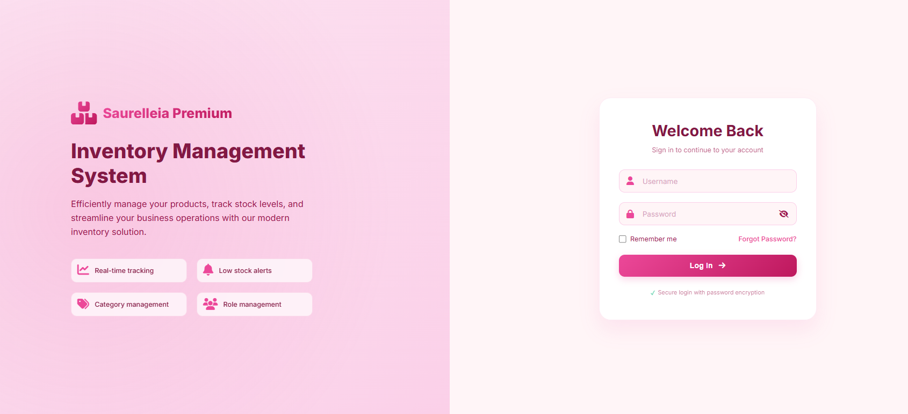
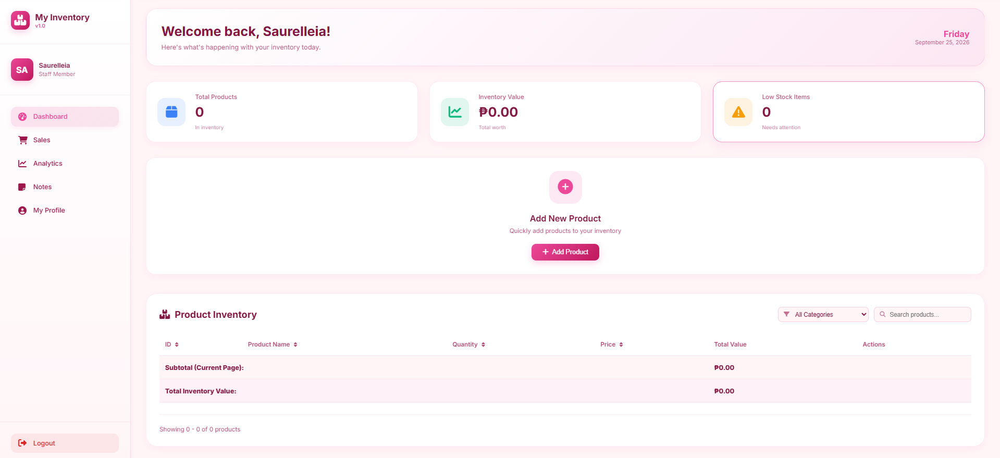
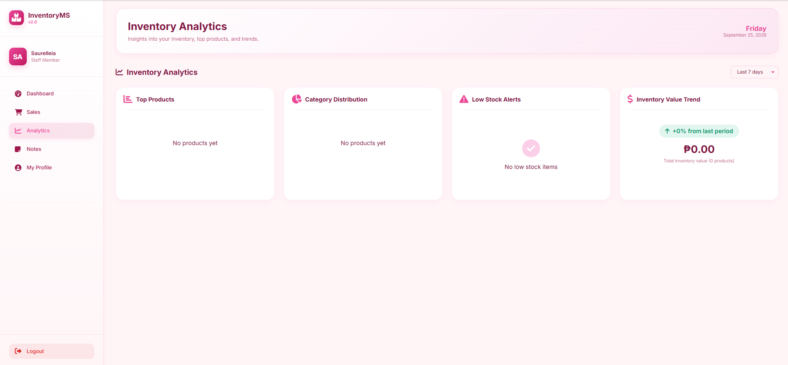
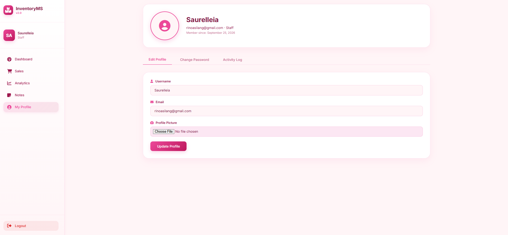

# 📦 InventoryMS v2.0

A modern, full-featured **Inventory Management System** built with PHP, MySQL, and vanilla JavaScript. Manage products, track sales, monitor analytics, and control user access — all wrapped in a clean pink-themed UI.


---

## ✨ Features

### 📊 Dashboard
- Real-time inventory value, product counts, and low-stock alerts
- Quick-add product modal with **searchable category dropdown**
- Sortable, searchable, paginated product table
- Per-page subtotal + overall inventory total

### 🛒 Sales Tracking
- Record sales with automatic inventory deduction (transactional)
- Edit or delete sales — inventory auto-adjusts
- **Best Selling Products** doughnut chart (Chart.js)
- Revenue stats: all-time, today, item count, transaction count

### 📈 Analytics
- Top 5 products by value
- Category distribution with progress bars
- Low-stock alerts with quick restock links
- Inventory value trend indicator

### 📝 Notes / Notepad
- Per-user notes with **pre-built templates**
- Live search, create, edit, delete
- Template insertion with confirmation

### 👥 User Management (Admin only)
- Create, edit, delete users
- Reset passwords via modal
- Role assignment: `admin` / `staff`
- Self-deletion protection

### 👤 Profile & Activity
- Edit username, email, profile picture
- Change password with verification
- Paginated **activity log** (login, edits, deletions, etc.)
- IP address tracking

### 🔐 Authentication
- Secure password hashing (`password_hash` / `password_verify`)
- **Forgot password** with email OTP (PHPMailer / Gmail SMTP)
- 3-step reset flow: request → verify → set new password
- Session-based access control with role guards

---

## 🖼️ Tech Stack

| Layer | Technology |
|-------|-----------|
| **Backend** | PHP 8.x (procedural + `mysqli`) |
| **Database** | MySQL / MariaDB |
| **Frontend** | HTML5, CSS3 (custom, no framework) |
| **Charts** | Chart.js 4.4 |
| **Icons** | Font Awesome 6.4 |
| **Fonts** | Inter (Google Fonts) |
| **Email** | PHPMailer (SMTP via Gmail) |
| **Security** | Bcrypt, prepared statements, session auth |

---

## 📁 Project Structure

```
inventory-system/
│
├── 📄 Core Pages
│   ├── index.php                  # Dashboard
│   ├── login.php                  # Login page
│   ├── logout.php                 # Session destroy
│   ├── profile.php                # User profile & activity
│   ├── sales.php                  # Sales tracking
│   ├── analytics.php              # Analytics dashboard
│   ├── notes.php                  # Notepad / notes
│   └── forgot_password.php        # OTP-based password reset
│
├── ⚙️ Actions (POST/GET handlers)
│   ├── add.php                    # Add product
│   ├── edit.php                   # Edit product
│   ├── delete.php                 # Delete product
│   ├── record_sale.php            # Record a sale
│   ├── edit_sale.php              # Edit sale form
│   ├── update_sale.php            # Update sale handler
│   ├── delete_sale.php            # Delete sale
│   ├── save_note.php              # Create/update note
│   ├── delete_note.php            # Delete note
│   ├── get_note.php               # Fetch note (AJAX)
│   ├── admin_add_users.php        # User management
│   ├── update_user.php            # Update user (AJAX)
│   ├── delete_user.php            # Delete user
│   ├── reset_password.php         # Admin reset user password
│   └── get_user.php               # Fetch user (AJAX)
│
├── 🔌 API Endpoints (JSON)
│   ├── get_top_products.php
│   ├── get_category_distribution.php
│   ├── get_low_stock.php
│   └── get_inventory_trend.php
│
├── 🧩 Includes
│   ├── db.php                     # DB connection
│   ├── functions.php              # logActivity() helper
│   ├── categories.php             # Category tree
│   └── templates.php              # Note templates
│
├── 📦 PHPMailer/
│   └── src/                       # PHPMailer library
│
├── 🎨 Assets
│   ├── style.css                  # Global stylesheet
│   └── uploads/                   # Profile pictures (auto-created)
│
└── 📖 README.md
```

---

## 🚀 Installation

### Prerequisites
- **XAMPP** / **WAMP** / **MAMP** (or any PHP 8+ with MySQL)
- **Composer** (optional, for PHPMailer)
- A Gmail account with **App Password** enabled (for OTP emails)

### Steps

1. **Clone the repository**
   ```bash
   git clone https://github.com/Jodum-Raine/saurelleia-inventory-management-system.git
   cd saurelleia-inventory-management-system
   ```

2. **Move to your web server root**
   ```bash
   # XAMPP example
   mv inventory-system C:/xampp/htdocs/
   ```

3. **Create the database**
   ```sql
   CREATE DATABASE inventory_db;
   USE inventory_db;
   ```

4. **Import the schema**

   ```sql
   -- Users
   CREATE TABLE users (
       id INT AUTO_INCREMENT PRIMARY KEY,
       username VARCHAR(50) UNIQUE NOT NULL,
       email VARCHAR(100) UNIQUE NOT NULL,
       password VARCHAR(255) NOT NULL,
       role ENUM('admin','staff') DEFAULT 'staff',
       profile_pic VARCHAR(255) DEFAULT NULL,
       reset_otp VARCHAR(6) DEFAULT NULL,
       reset_otp_expiry DATETIME DEFAULT NULL,
       created_at TIMESTAMP DEFAULT CURRENT_TIMESTAMP
   );

   -- Products
   CREATE TABLE products (
       id INT AUTO_INCREMENT PRIMARY KEY,
       product_name VARCHAR(255) NOT NULL,
       quantity INT DEFAULT 0,
       price DECIMAL(10,2) DEFAULT 0.00,
       category VARCHAR(100) DEFAULT NULL
   );

   -- Sales
   CREATE TABLE sales (
       id INT AUTO_INCREMENT PRIMARY KEY,
       product_id INT NOT NULL,
       product_name VARCHAR(255) NOT NULL,
       quantity INT NOT NULL,
       price_per_unit DECIMAL(10,2) NOT NULL,
       total_amount DECIMAL(10,2) NOT NULL,
       sold_by INT DEFAULT NULL,
       sold_at TIMESTAMP DEFAULT CURRENT_TIMESTAMP
   );

   -- Notes
   CREATE TABLE notes (
       id INT AUTO_INCREMENT PRIMARY KEY,
       user_id INT NOT NULL,
       title VARCHAR(255) NOT NULL,
       content TEXT,
       created_at TIMESTAMP DEFAULT CURRENT_TIMESTAMP,
       updated_at TIMESTAMP DEFAULT CURRENT_TIMESTAMP ON UPDATE CURRENT_TIMESTAMP
   );

   -- Activity Logs
   CREATE TABLE activity_logs (
       id INT AUTO_INCREMENT PRIMARY KEY,
       user_id INT NOT NULL,
       action VARCHAR(100) NOT NULL,
       details TEXT,
       ip_address VARCHAR(45),
       created_at TIMESTAMP DEFAULT CURRENT_TIMESTAMP
   );
   ```

5. **Create the first admin**

   Generate a bcrypt hash:
   ```bash
   php -r "echo password_hash('yourpassword', PASSWORD_DEFAULT);"
   ```

   Then insert:
   ```sql
   INSERT INTO users (username, email, password, role) VALUES (
       'admin',
       'admin@example.com',
       '$2y$10$YOUR_BCRYPT_HASH_HERE',
       'admin'
   );
   ```

6. **Configure the database**

   Edit `db.php`:
   ```php
   $db_server = "localhost";
   $db_user   = "root";
   $db_pass   = "";
   $db_name   = "inventory_db";
   ```

7. **Configure email (for forgot-password OTP)**

   Edit `forgot_password.php`:
   ```php
   $mail->Username = 'your-email@gmail.com';
   $mail->Password = 'your-16-char-app-password';
   ```
   > ⚠️ **Use a Gmail App Password**, not your real password.
   > Enable 2FA → [App Passwords](https://myaccount.google.com/apppasswords)

8. **Ensure uploads folder is writable**
   ```bash
   mkdir uploads
   chmod 755 uploads   # Linux/macOS
   ```

9. **Launch**
   ```
   http://localhost/saurelleia-inventory-management-system/login.php
   ```

---

## 🔑 Default Login

| Field | Value |
|-------|-------|
| Username | `admin` |
| Password | *(whatever you hashed)* |

**⚠️ Change this immediately after first login via Profile → Change Password.**

---

## 🎨 Design System

| Token | Value | Usage |
|-------|-------|-------|
| Primary | `#ec4899` | Buttons, accents, gradients |
| Primary Dark | `#be185d` | Gradient end |
| Text Dark | `#831843` | Headings |
| Text Mid | `#9d174d` | Body text, labels |
| Background | `#fff5f7` | Page background |
| Card Border | `rgba(236,72,153,0.15)` | Subtle outlines |
| Success | `#10b981` | Confirm actions |
| Danger | `#dc2626` | Delete actions |

---

## 🔒 Security Features

- ✅ **Prepared statements** on all DB queries (SQL injection prevention)
- ✅ **`password_hash()` / `password_verify()`** for credentials
- ✅ **Session-based auth** with role checks (`$_SESSION['role']`)
- ✅ **HTML escaping** via `htmlspecialchars()` on all output
- ✅ **Ownership verification** on notes (users only see their own)
- ✅ **Self-deletion protection** for admin accounts
- ✅ **IP logging** on every activity
- ✅ **Transaction safety** on sale operations (rollback on error)

---

## 📸 Screenshots

### 🔐 Login


### 📊 Dashboard


### 🛒 Sales Tracking


### 📈 Analytics


### 📝 Notes


### 👤 Profile


---

## 🧪 Known Limitations

- No CSRF tokens on forms (add if deploying publicly)
- OTP is stored in plain text in DB (consider hashing)
- Gmail credentials are hardcoded (use `.env` in production)
- No rate limiting on login / OTP requests
- `get_inventory_trend.php` uses a stubbed change percentage

---

## 🛣️ Roadmap

- [ ] Add CSRF protection
- [ ] Move credentials to `.env`
- [ ] Add receipt generation (PDF)
- [ ] Barcode scanner integration
- [ ] Multi-warehouse support
- [ ] Export to CSV/Excel
- [ ] Dark mode toggle
- [ ] REST API layer

---

## 🤝 Contributing

1. Fork the repo
2. Create a feature branch (`git checkout -b feature/amazing-feature`)
3. Commit your changes (`git commit -m 'Add amazing feature'`)
4. Push to the branch (`git push origin feature/amazing-feature`)
5. Open a Pull Request

---

## 📄 License

This project is licensed under the **MIT License** — see the [LICENSE](LICENSE) file for details.

---

## 👤 Author

**John Jodum Raine D. Jocsing**
- 🎓 3rd-year BSIT Student
- 💻 Front-end Developer & Video Editor
- 📍 Quezon City, Philippines

[](https://github.com/Jodum-Raine)
[](https://www.linkedin.com/in/raine-dumagat-003aa53bb)
[](https://www.facebook.com/Itsyourboiiharuuuu)
[](https://www.instagram.com/_akiiraaaaaaaa)

---

## 🙏 Acknowledgements

- [Font Awesome](https://fontawesome.com/) — icons
- [Chart.js](https://www.chartjs.org/) — charts
- [Google Fonts](https://fonts.google.com/) — Inter typeface
- [PHPMailer](https://github.com/PHPMailer/PHPMailer) — email delivery

---

<p align="center">
  <strong>Built by hand and ideas — no template. 🎀</strong><br>
  <sub>© 2026 John Jodum Raine D. Jocsing</sub>
</p>
